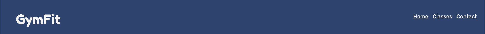
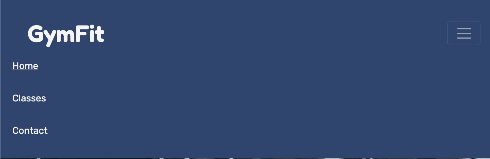
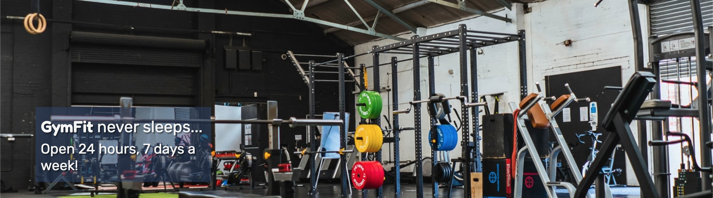
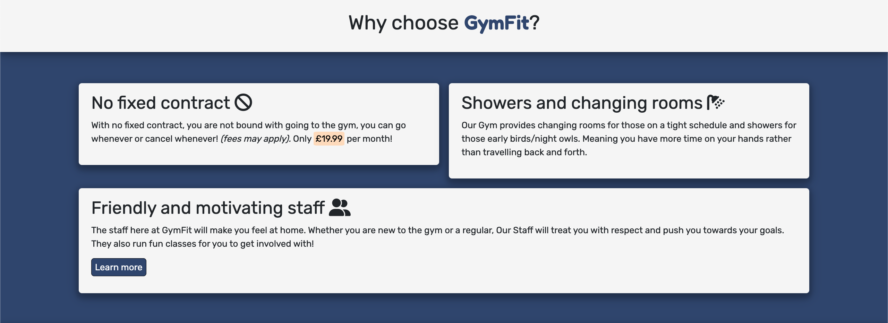
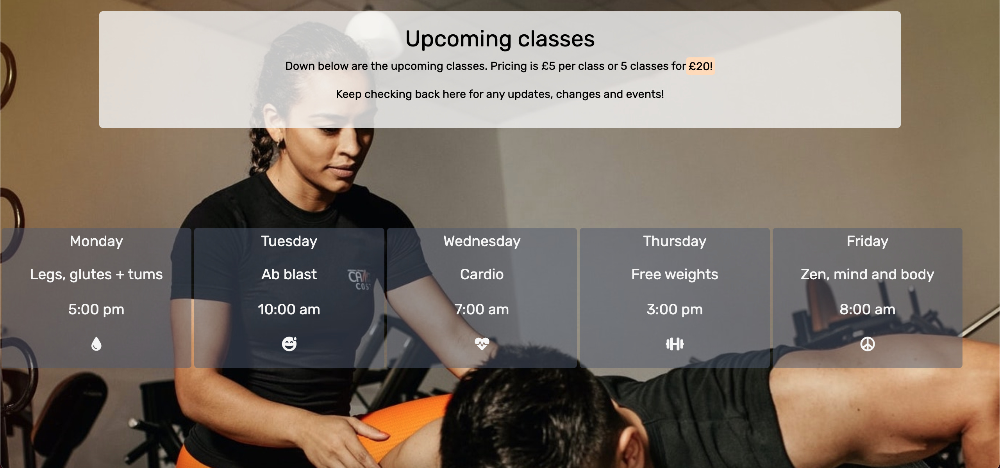

# GymFit

GymFit is a brand new locally owned gym opening in Brixham! Tailored for early birds or night owls, GymFit is open 24 hours a day, 5 days a week! The aim for this site is to introduce our new gym and their available classes, opening times, photos and contact information.

A deployed link is available [here.](https://joshfreeman00.github.io/GymFit/)

## Showcase of the site

A showcase of the site will be here. 

## UX

## Goals

### First time visitor:

As a first time visitor;

* I want to clearly understand the context of the website and to learn more about the Gym.
* I want to use the navigation bar to be taken to the appropiate page and, for better user experience, be able to go back to the home page within a click of a button.
* I want to be able to clearly see the pricing.
* I want to simply be able to contact the gym and enquire.

### Returning visitor:

As a Returning visitor;

* I would want to look at what classes are available and times they're on.
* I want to be able to contact the gym with ease and ask any questions using the contact form or contact info provided.
* I want to easily find socail media links connected to the Gym.

### Frequent visitor:

As a Frequent visitor;

* I want to be able to check if there are any additions/changes to the classes, events or updates.
* I would like to access the site easily on a mobile phone or tablet.

## Structure

### Logo and Navigation bar

* The name of the gym, GymFit, is located on the top left of the webpage, along with the ability of returning to the home page just by clicking on the logo.
* The navigation links are located on the top right of the webpage, which link to the other available pages. Here users can easily use thee links to navigate from each webpage, along with being shown which page you are on from the underline of the text.
* For smaller devices, the navigation bar changes to a burger menu for a more responsive design for mobile or tablet users, this allows for a compact and user friendly design. 

### Header

* The Header contains the hero image of gym equipment.
* On the left is cover text containing the slogan along with the opening times.
* The image provides context of what the webiste is about along with the covet text which provides the vital opening times.

### Home Page

* The home page is the first page that opens when opening the website, it clearly states the name of the website along with a large, full-width image that includes a zooming in animation, this is to catch the eye of the user.

### Why choose GymFit?

* Within this section is the heading that provides infomation on why the user should join GymFit as well as 3 sections on the benifits on joining.
* These sections have a white background, contrasting the blue theme of the webpage along with black text in which all provides the user accessabilty in reading the text.

### Footer

* The footer provides links to 3 of there social media accounts along with text. They purposely open a new tab to allow the user to easily navigate to different social platforms while still being connected the the website for easy access back to the webpage.
* Icons are used for the links instead of text to provide a minimalistic look while still providing infomation on which social media platform is which from the use of their logo.
* The text explains what the icon links provide.

### Classes Page

* The classes page contains a section at the top that provides infomation on what the page includes and the pricing of said classes.
* The classes page also displays infomation of the classes availble which includes the times, days and what the classes have to offer along with a icon thats linked to what the class is about.
* the page also includes a background image of a person helping someone else, this is provides a background image that is relivant to the page.
* the design of the heading and times allow the user to easily read the text because of the contrast of the text color and the background of the text. The background of the text is also semi-transparent to allow the user to still see the background image while still being able to read the text.

### Contact Page

* The contact page provides a header that explains what the page is for.
* The contact page also contains a form that allows the user to sumbit their infomation.
* The form collects the users first name, last name, email, contact number and any comments which are all required to successfully sumbit the form.

## Design

### Images

The images used throughout the website are relivant to each page they are on.

* The langing image is used to should off the equipment the gym has to offer along with a zooming in animation that draws attention of the user.
* The background image for the classes page someone helping someone else, this is relivant to what the page is about.
* Lastly the background image for the contacts page, although not relivant, its blurred so that the user does not need to pay attention to the image, its purpose is to provide a better design than a dull single colour background.

### Colour scheme

* The use of a blue palette within this theme provides a non-threatening feel for the user and provides tranquility too.

### Fonts 

* Fredoka font is the main font used throughout the website and features rounded edges on the text. A fullback font of Sans-Serif is used just in case for whatever the reason is that the font isnt loaded correctly.

The link to this font is found [here.](https://fonts.google.com/specimen/Fredoka?query=fredoka)

* Rubik is used for the logo of the web page that is more rounded and thicker than Fredoka, this makes it stand out amongst the rest of the text. This provides User Clarity allowing the user to easily spot the websites title. A fullback font of Sans-Serif is used just in case for whatever the reason is that the font isnt loaded correctly.

The link to this font is found [here.](https://fonts.google.com/specimen/Rubik?query=rubik)

The use of rounded is used for a casual theme, making the user feel at home.

## Wireframes

The wireframes for the webpage can be viewed here.

* index.html

* index.html - Mobile

* classes.html

* classes.html - Mobile

* contact.html

* contact.html - Mobile

## Languages

* [HTML5](https://en.wikipedia.org/wiki/HTML5)
* [CSS](https://en.wikipedia.org/wiki/CSS)

## Tools

* Gitpod - used as a cloud based IDE.
* Github - used to secure code online.
* Git - version control.
* Balsamiq - used to create wireframes.
* Google Fonts - for the two fonts that were used.
* Font Awesome - for the various icons used.
* Adobe Color - for the color palette.
* Google Chrome Dev tools - for proof reading code.

## Testing

To view all testing documentation click [here](TESTING.md)

## Deployment

The site was deployed to GitHub pages. The steps to deploy are as follows: 
  - In the [GitHub repository](https://github.com/joshfreeman00/GymFit), navigate to the Settings tab 
  - From the source section drop-down menu, select the **Main** Branch, then click "Save".
  - The page will be automatically refreshed with a detailed ribbon display to indicate the successful deployment.

The live link can be found [here](https://joshfreeman00.github.io/GymFit/)

### Local Deployment

In order to make a local copy of this project, you can clone it. In your IDE Terminal, type the following command to clone my repository:

- `git clone https://github.com/joshfreeman00/GymFit.git`

Alternatively, if using Gitpod, you can click below to create your own workspace using this repository.

## Credits

* Font awesome - The icons used. [Link](https://fontawesome.com/icons)
* Bootstrap v4.3 - The grid system code. [Link](https://getbootstrap.com/docs/4.3/getting-started/introduction/)
* Google fonts - For the Fredoka and Rubik fonts that were used. [Link](https://fonts.google.com/)
* w3schools - For the box shadow code and consistant help throughout. [Link](https://www.w3schools.com/default.asp)
* My mentor - For helpful tips and debugging.
* Love Running - The code to make the hero-image and animation effect on the homepage was used from Code Institute.
* Unsplash - All the images used used within the web page were sourced from here.
  - The home pages hero image is found [here.](https://unsplash.com/photos/fqMu99l8sqo)
  - The classes background image is found [here.](https://unsplash.com/photos/R0y_bEUjiOM)
  - The contact pages background image can be found [here.](https://unsplash.com/photos/FMQBLyhD2HU)

## Acknowledgements

* To create this website, I used material and infomation covered in the Full Stack Development course by Code Institute. As well as information from the gitSlack Community Channels, Stack Overflow and W3Schools.

* Tim Nelson, my mentor, for reviewing my work and providing useful, help, feedback and advice throughout.